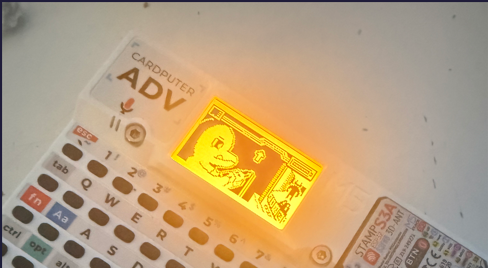
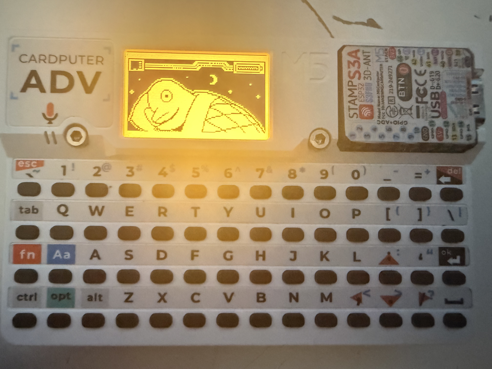
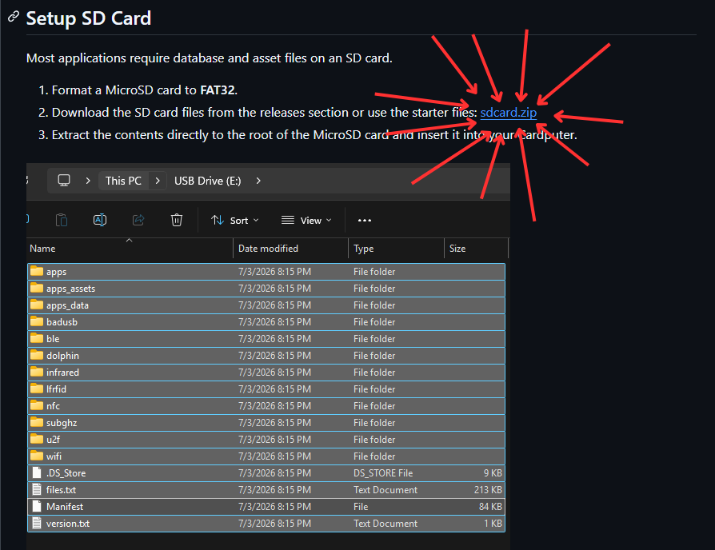
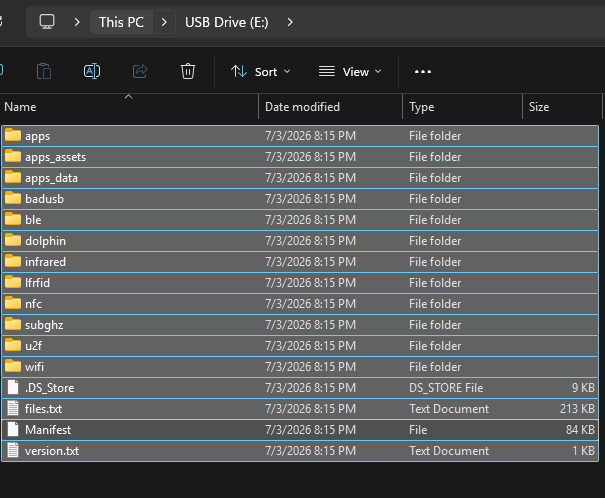

# Flipper Zero meets M5Stack Cardputer

A port of the [Flipper Zero](https://flipperzero.one/) firmware to the **M5Stack Cardputer** and **M5Stack Cardputer ADV**. This project brings the Flipper Zero UI, services, and application framework to affordable ESP32-S3 hardware.

## Discord

Join the [Flipper Zero meets ESP32 - Discord](https://discord.gg/5DnAqFXaBC) for support, releases, and announcements.

## Supported Hardware



| Feature | M5Stack Cardputer (Standard) | M5Stack Cardputer ADV |
|---|---|---|
| **MCU** | ESP32-S3 (8 MB Flash, No PSRAM) | ESP32-S3 (8 MB Flash, No PSRAM) |
| **Display** | ST7789V2 240×135 RGB565 | ST7789V2 240×135 RGB565 |
| **Keyboard** | 56-key matrix via 74HC138 | 56-key matrix via TCA8418 (I2C) |
| **Sub-GHz (CC1101)** | — | Yes (SPI3 shared with SD) |
| **NRF24 (2.4 GHz)** | — | Yes (CE=4, CSN=6) |
| **Infrared (IR)** | TX (GPIO 44) | TX (GPIO 44) + RX (GPIO 1) |
| **Audio** | NS4168 I2S Speaker Amp | ES8311 I2S Codec (I2C) |
| **IMU (Motion)** | — | BMI270 (I2C) |
| **RGB LED** | — | WS2812 (GPIO 21) |
| **SD Card Slot** | Yes (SPI3) | Yes (SPI3) |

> ⚠️ M5Stack Cardputer is not available, Coming soon




---
## **Frequent Question**
## Can i run flipper zero without SD card?
- Anwser: No, SD card is required to work properly
- Set up **[SD Card](https://github.com/ElicoftZ/Flipper-Zero-meets-M5Stack-Cardputer#setup-sd-card)**
## Where to get the files?
 - Answer:
 

---

## Navigation Key Mapping

The physical keyboard is fully mapped to navigate the Flipper Zero UI:

| Flipper Key | Cardputer Key |
|---|---|
| **Up** | `↑` (Fn + `;` keycap) |
| **Down** | `↓` (Fn + `.` keycap) |
| **Left** | `←` (Fn + `,` keycap) |
| **Right** | `→` (Fn + `/` keycap) |
| **OK** | `Enter` |
| **Back** | `Backspace` or `Esc` (`\`` keycap) |

*Full keyboard typing (printable ASCII characters) is supported in text fields.*

---
## Apps

### 📡 Wireless / RF

#### Sub-GHz
External CC1101 receiver/transmitter for 433–868 MHz signals.
- Receive & decode
- Read RAW: capture unknown waveforms to `.sub` files for later analysis
- Frequency analyzer with sweep & live RSSI
- Hopper: scan all preset bands during receive
- Transmit saved files; manual signal creation (frequency, modulation, protocol, key/serial/counter)
- Brute force / sub-brute attack with manufacturer dictionary
- Playlist for sequential transmit
- **TPMS decoding** — tire-pressure sensors: Schrader GG4, Citroën, Ford, Renault, Toyota (PMV107J) and a generic decoder; dedicated info view with editable sensor data
- **Limitation:** AES-encrypted manufacturer keystores (`keeloq_mfcodes`, `nice_flor_s`, `alutech_at_4n`) are not decryptable on this port — only the plain-text `keeloq_mfcodes_user` works for Keeloq decoding.

#### Sub-GHz Remote
Multi-button remote layouts that batch saved `.sub` files. Map Up/Down/Left/Right/OK to individual transmit signals; switch between persistent remote profiles.

#### WiFi
Full WiFi pentest toolkit.
- **Scanner** — SSID, BSSID, channel, RSSI, auth mode
- **Connect** — auto-detect WPA/WPA2/WPA3, password input or saved password lookup (`/ext/wifi/<ssid>.txt`)
- **Deauther** — SSID-mode (single AP) or Channel-mode (all on channel)
- **Sniffer** — capture packets to PCAP
- **Handshake capture** — record EAPOL 4-way handshakes, optionally with deauth trigger
- **AirSnitch** — auto-bruteforce target with password list
- **Beacon Spam** — Funny SSIDs / Rickroll / Random / Custom
- **Network Scan / Port Scan** — host discovery + 19 common-port probe on the connected network
- **Web Crawler** — domain-based web crawler
- **Evil Portal** — captive portal with credential harvesting
  - Built-in templates: Google login, Router firmware update
  - Custom templates from `/ext/wifi/evil_portal/login_template/*.html` and `/ext/wifi/evil_portal/router_template/*.html` (filename = template name in dropdown)
  - Marker substitution: `%ERROR%`, `%SSID_OPTIONS%` (live AP scan)
  - Router-style verify flow: dropdown of real SSIDs, live WLAN re-auth check, captured-credentials screen on success, retry with error banner on fail
  - Pause/Resume of the AP from the run screen
  - Captured creds saved to `/ext/wifi/evil_portal/<ssid>_creds.csv`
  - **Internet bridge** *(new)* — optional STA uplink with NAPT + DNS forwarding so victims get real internet behind the portal; iOS captive-portal "Success" handling; uplink SSID/password configured in-app

#### Mesh / Buddy *(ESP-NOW)*
Pair cheap headless ESP32 boards (**buddies**) to the T-Embed (**master**) over ESP-NOW to offload WiFi capture and run remote actions.
- Buddy discovery, pair/remove and live status from the lock menu → **Mesh Clients**
- **Device Identify** — make a paired buddy blink to locate it
- **WiFi handshake capture** — buddy passively captures EAPOL handshakes on a chosen channel (1–13)
- **Store-and-forward** — the buddy holds each complete handshake (M1–M4 + beacon) durably (RAM + NVS) per BSSID and delivers it as one acknowledged unit, surviving master absence and buddy reboots
- One `.pcap` per network written to `/ext/wifi/buddy_<name>_<ssid>.pcap`; "Handshake received" overlay on all mesh views
- Buddy firmware ships in this repo under [`buddy_firmware/`](buddy_firmware/) (standalone headless ESP-IDF project)

#### Bluetooth
- **BLE Spam** — Apple Continuity (Pair/Action/NotYourDevice), Google FastPair (455+ models), Microsoft SwiftPair, Samsung Buds & Watch, Xiaomi QuickConnect
- **BLE Walk** — passive scanner with GATT service/characteristic inspection
- **BLE Clone** *(dev)* — replicate active BLE advertisements
- **FindMy** — emulate Apple AirTag, Samsung SmartTag, Tile beacons (clone or generate keypairs)
- **HID** *(see below)* — keyboard/mouse/media remote over BLE
- **Bad USB** — via USB or BLE

#### NRF24 *(2.4 GHz, external nRF24L01)*
- **Spectrum analyzer** — live 2.4 GHz channel activity
- **Jammer** *(rewritten)* — one engine with switchable channel sources (Protocol / Manual / WiFi / Activity scan), strategies (CW / Flood / Turbo) and presets; configuration persists per source
- **MouseJacker** — inject keystrokes into vulnerable wireless mice/keyboards
- Also available as a FAP (`nRF24_jammer`)

#### Infrared
RMT-based TX + RX.
- Learn signals (auto-decoded or raw)
- Browse, edit, and send saved remotes
- Universal remotes: TV, AC, audio, projectors, fans, LED controllers (databases on SD)
- Brute force category-based databases
- Configurable IR pin and 5 V GPIO power
- Protocols: NEC, NEC42, Samsung32, RC5/RC5X, RC6, SIRC 12/15/20, Kaseikyo, RCA, Pioneer

### 🪪 NFC

#### NFC *(PN532 over I2C)*
- Read, save, emulate, write NFC cards/tags
- Manual card generation (custom UID/ATQA/SAK)
- Mifare Classic dictionary attack (system + user dictionaries)
- Mifare Ultralight-C dictionary unlock
- ISO15693 SLIX unlock with manual or stored DEF key
- FeliCa system info, MIFARE DESFire app inspection, EMV transaction history
- 14 supported protocols: ISO14443-3A/3B/4A/4B, ISO15693-3, FeliCa, MIFARE Classic/Ultralight/Plus/DESFire, SLIX, ST25TB, NTAG4xx, Type-4
- 30+ supported card auto-parsers (Charlie Card, Clipper, EMV, Gallagher, HID, Opal, Skylanders, Troika, …)

### ⌨️ HID / USB

#### Bad USB
HID payload runner for Ducky-script (`.txt`) files from `/ext/badusb/`.
- 16+ Ducky commands (DELAY, STRING, REPEAT, HOLD/RELEASE, MEDIA keys, mouse, ALT-CHAR/ALT-STRING, SYSRQ)
- Layouts under `/ext/badusb/assets/layouts/*.kl` (~30 included)
- Configurable USB VID/PID + device name
- BLE bonding with custom MAC and PIN-verify pairing
- Mouse movement, scroll, button emulation; per-character typing delay
- **Transport:** USB OTG (TinyUSB) on T-Embed, BLE on Waveshare

### 🛠 System / Tools

#### Lock Menu / System Toggles
The desktop lock menu doubles as the central system control panel (board-dependent, scrollable):
- **qFlipper** — enable the qFlipper desktop bridge (VID/PID spoof + CDC RPC) so the official qFlipper app can connect *(USB-OTG boards)*
- **USB Storage** — expose the SD card as a USB mass-storage device *(USB-OTG boards)*
- **Bluetooth** — toggle BLE on/off
- **Mesh Clients** — buddy discovery & control *(see Mesh / Buddy above)*

#### Archive
SD-card file browser with tabs per media type: Favorites, Sub-GHz, NFC, LF-RFID, Infrared, iButton, Bad USB, U2F, Apps, Internal, Browser. Pin/unpin favorites; copy, paste, rename, delete, create folder.

### ⚙ Settings & General
Bluetooth, backlight, clock, dolphin/passport, expansion port, input, notification, power, storage, system info, factory reset. Animated dolphin desktop on idle. File-pack manifest at `/ext/Manifest` (qFlipper-style asset list — its presence suppresses the "No DB" boot animation).

---

## How to Flash

### Method 1: Web Flasher (Easiest)

Connect your Cardputer over USB and use the online flasher in a Chrome/Edge browser:
# (Coming soon)
 👉 **[Flash via Browser]**  

### Method 2: Flash the Merged Binary Directly

After building, a single merged binary is automatically generated in the project root:

```powershell
# Flash the merged binary (using esptool)
esptool.py --chip esp32s3 -b 460800 write_flash 0x0 Flipper-cardputer_adv-merged.bin
```

---

## Setup SD Card

Most applications require database and asset files on an SD card. 
1. Format a MicroSD card to **FAT32**.
2. Download the SD card files from the releases section or use the starter files:
   [sdcard.zip](https://github.com/Sor3nt/Flipper-Zero-ESP32-Port/releases/download/v1.1.5/sdcard.zip)
3. Extract the contents directly to the root of the MicroSD card and insert it into your Cardputer.


---

## Building from Source

### Prerequisites

1. Install **[ESP-IDF v5.4.1](https://docs.espressif.com/projects/esp-idf/en/v5.4.1/esp32s3/get-started/)**.
2. Source the ESP-IDF export script:
   * **Linux/macOS**: `source ~/esp/esp-idf/export.sh`
   * **Windows (Standard CMD)**: `C:\Espressif\frameworks\esp-idf-v5.4.1\export.bat`

### Building on Windows (Recommended Wrapper)

We provide a custom script `build_adv.bat` in the root folder that configures your ESP-IDF python environments and triggers the build:

```powershell
# Run the bat script directly
.\build_adv.bat
```

Or you can use `winbuild.py` manually:

```powershell
# Build Cardputer ADV (Default)
python winbuild.py build --board cardputer_adv

# Build Standard Cardputer
python winbuild.py build --board cardputer
```

### Building on Linux / macOS

```bash
# Build Cardputer ADV
./build.sh --board cardputer_adv --build-only

# Build Standard Cardputer
./build.sh --board cardputer --build-only
```

---

## How to Install (Step-by-Step)

### Step 1: Flash the Firmware
You can flash the pre-compiled merged binary directly to your Cardputer:
1. Connect your M5Stack Cardputer to your PC using a USB-C cable.
2. Download the latest `Flipper-cardputer_adv-merged.bin` (or build it yourself).
3. Use `esptool.py` to write the image directly to the flash offset `0x0`:
   ```powershell
   esptool.py --chip esp32s3 -b 460800 write_flash 0x0 Flipper-cardputer_adv-merged.bin
   ```
   *(Alternatively, you can use the Espressif GUI Flash Download Tool or any web flasher).*

### Step 2: Prepare the MicroSD Card
The firmware requires specific asset files to run Flipper Zero apps:
1. Format a MicroSD card to **FAT32**.
2. Download the **`sdcard.zip`** starter pack.
3. Extract the ZIP contents directly to the root directory of your MicroSD card.
4. Insert the card into your Cardputer's SD slot.

### Step 3: Boot Up
1. Toggle the power switch on the Cardputer to turn it on.
2. The Flipper home screen will load, showing your digital pet on the desktop!

---

## Credits

* **[Sor3nt](https://github.com/Sor3nt/Flipper-Zero-ESP32-Port)** for the original Flipper Zero port for ESP32.
* **[0xhalloween](https://github.com/0xhalloween/Flipper-Zero-ESP32-ADV)** for adding the M5Stack Cardputer support.
* **Flipper Devices Inc.** for the original firmware and application framework.


